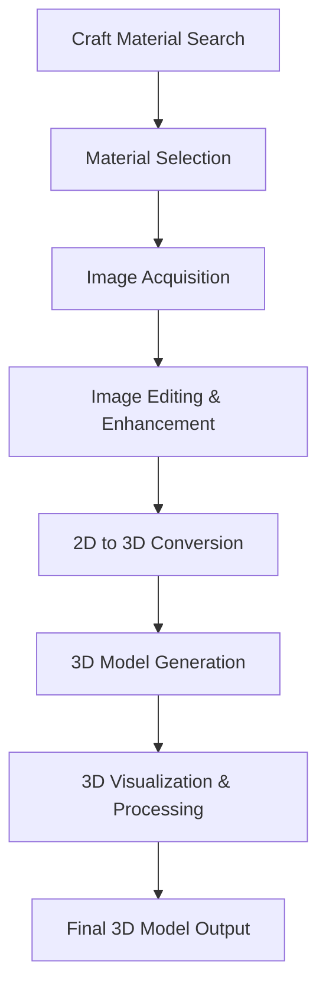

# Talk2Buy

A comprehensive toolkit for discovering craft materials, converting 2D images to 3D models, and visualizing 3D data. This project provides an end-to-end workflow from material research to 3D model creation and processing.

## 👥 Contributors

- **[Your Name]** - Project Co-creator
- **[Colleague Name]** - Project Co-creator

## 🔧 Project Overview

Talk2Buy consists of three integrated components that work together in a seamless pipeline:

1. **Craft Material Scraper** - Research and discover craft materials with image editing capabilities
2. **Image to 3D Model Generator** - Convert 2D images into 3D models using AI-powered depth estimation
3. **3D Process Visualizer** - Interactive 3D data visualization and processing

## 🚀 Quick Start

### Installation

Install all required dependencies with:

```bash
# Core dependencies for all components
pip install opencv-python numpy matplotlib PyQt5 requests beautifulsoup4 selenium networkx

# For Craft Material Scraper
pip install serpapi

# For Image to 3D Model Generator
pip install torch torchvision trimesh open3d scikit-image ultralytics timm

# For 3D Process Visualizer (if using Jupyter)
pip install jupyter
```

### Running the Applications

```bash
# Launch craft material scraper
python craft_material_app.py

# Launch 2D to 3D converter
python image_to_3d_app.py

# Launch 3D visualizer
jupyter notebook 3D_process.ipynb
```

## 📋 Component Details

### 1. Craft Material Scraper 🔍

**Purpose**: Search, discover, and edit craft materials with integrated YouTube tutorial finder.

**Key Features**:
- Material search by name and craft type
- Filter by fabric or crafting supplies  
- Built-in image editor with 20+ effects
- YouTube tutorial integration
- Website packaging material scraper
- Material statistics visualization

**Image Editor Operations**:
| Category | Operations |
|----------|------------|
| **Basic Effects** | Grayscale, Blur, Sharpen, Edge Detection, Emboss |
| **Artistic** | Sepia, Cartoon Effect, Pencil Sketch, Oil Painting |
| **Geometric** | Rotate, Flip, Resize, Crop |
| **Color** | Brightness/Contrast, RGB Balance, Threshold |
| **Advanced** | Text Overlay, Watermark, Histogram Equalization |

**Interface Tabs**:
- **Craft Search**: Material discovery and YouTube tutorials
- **Image Editor**: Photo enhancement and effects
- **Packaging**: Website scraping for materials
- **Statistics**: Data visualization and analytics

**Keyboard Shortcuts**:
- `Enter`: Trigger search in search fields
- `Ctrl+O`: Open image in editor
- `Ctrl+S`: Save image in editor
- `Ctrl+Z`: Reset image in editor

### 2. Image to 3D Model Generator 🤖

**Purpose**: Convert 2D images into 3D models using advanced AI techniques.

**Key Technologies**:
- **YOLO v5**: Object detection for automatic ROI selection
- **MiDaS**: Intel's depth estimation models
- **Open3D & Trimesh**: 3D reconstruction and mesh generation

**Features**:
- Automatic object detection and ROI selection
- Intelligent depth estimation with multiple model options
- Object-specific parameter optimization
- Multiple output formats (.ply, .obj, .stl, .glb)
- Interactive GUI with real-time preview

**AI Models Used**:
| Model | Use Case | Quality |
|-------|----------|---------|
| **DPT_Large** | High-resolution, sharp images | Highest |
| **DPT_Hybrid** | Medium-quality images | Medium |
| **MiDaS_small** | Low-quality/fast processing | Basic |

**GUI Layout**:
- **Left Panel**: Input settings, ROI selection, output configuration
- **Right Panel**: Input image, depth map, and results tabs

**Recommended Parameters by Object Type**:
| Object Type | Scale Z | Smoothing | Detail | Outlier Removal |
|-------------|---------|-----------|--------|-----------------|
| People      | 0.6     | 5         | 9      | 2.0             |
| Vehicles    | 0.5     | 3         | 9      | 1.8             |
| Objects     | 1.0     | 7         | 8      | 2.2             |

### 3. 3D Process Visualizer 📊

**Purpose**: Interactive 3D data visualization and processing in Jupyter notebooks.

**Features**:
- Interactive 3D plotting with Matplotlib
- GUI controls for real-time parameter adjustment
- Support for point clouds and mesh data
- Export capabilities (PNG/JPG, PLY/OBJ, HTML)
- Performance optimization for large datasets

**Visualization Options**:
| Data Type | Recommended Settings |
|-----------|---------------------|
| **Complex 3D Models** | High mesh detail, 3-point lighting, Spectral colormap |
| **Point Clouds** | 2-5px point size, 0.5-0.8 alpha, Viridis colormap |
| **Quick Previews** | Low mesh detail, Basic lighting, No shadows |

**Export Formats**:
- **2D Views**: PNG, JPG
- **3D Models**: PLY, OBJ
- **Interactive**: HTML (via mpld3)

## 🔄 Talk2Buy Workflow Pipeline



### Typical Use Case:
1. **Research Phase**: Use the Craft Material Scraper to find materials and inspiration
2. **Image Preparation**: Edit and enhance images using the built-in editor
3. **3D Generation**: Convert selected images to 3D models using AI-powered depth estimation
4. **Processing**: Visualize and refine 3D models using the interactive processor

## 🛠️ Technical Architecture

### Component Technologies

| Component | Core Technologies |
|-----------|------------------|
| **Craft Scraper** | PyQt5 GUI, BeautifulSoup4 + Selenium, OpenCV, SerpAPI |
| **Image to 3D** | YOLOv5s, MiDaS, Open3D, Trimesh |
| **3D Visualizer** | Matplotlib 3D, PyQt5, NumPy, Poly3DCollection |

### AI Pipeline Details

**Object Detection (YOLO)**:
- Uses YOLOv5s (smallest, fastest version)
- Automatic ROI selection with confidence scoring
- Object-specific parameter optimization
- Fallback to traditional ROI methods

**Depth Estimation (MiDaS)**:
- Automatic model selection based on image quality
- Depth normalization and filtering
- Outlier clipping (2nd-98th percentile)
- Bilateral filtering for smoothing

**3D Reconstruction**:
- Point cloud generation from depth + RGB
- Poisson surface reconstruction
- Mesh smoothing and optimization
- Multiple export format support

## 📁 Project Structure

```
talk2buy/
├── craft_material_app.py          # Main craft scraper application
├── image_to_3d_app.py             # 2D to 3D converter
├── 3D_process.ipynb               # 3D visualization notebook
├── docs/
│   ├── Craft Material.txt         # Craft scraper documentation
│   ├── Model (Imageto3D).txt      # 2D-3D converter guide
│   └── 3D process.txt             # 3D visualizer help
├── examples/                      # Sample data and outputs
├── models/                        # Pre-trained model cache
└── README.md                      # This file
```

## 🎯 Key Features Highlight

- **End-to-End Pipeline**: Seamless workflow from material research to 3D model creation
- **AI-Powered**: Leverages YOLO and MiDaS for intelligent processing
- **User-Friendly**: Intuitive GUI interfaces for all components
- **Flexible Output**: Multiple export formats and customization options
- **Performance Optimized**: Efficient processing with fallback options
- **Integrated Workflow**: Components designed to work together seamlessly

## 🐛 Troubleshooting

### Common Issues and Solutions:

**1. Search/Scraping Issues**:
```bash
# No search results
- Check internet connection
- Try different search terms
- Verify SerpAPI key if using
```

**2. CUDA/GPU Issues**:
```bash
# CUDA not available
- All components automatically fall back to CPU
- Check GPU drivers if CUDA desired
```

**3. Memory Errors**:
```bash
# Large dataset issues
- Use smaller images for 3D conversion
- Try MiDaS_small model
- Reduce mesh detail for visualization
```

**4. Image Processing Issues**:
```bash
# Editor problems
- Ensure image is loaded first
- Try smaller images for complex operations
- Check file permissions for saving
```

**5. Poor 3D Results**:
```bash
# Quality issues
- Try different ROI selection methods
- Adjust depth scale and smoothing parameters
- Use higher quality input images
- Increase mesh detail level
```

## 📖 Usage Examples

### Basic Workflow Example:

```python
# 1. Search for materials
# Launch craft_material_app.py
# Search: "cotton fabric"
# Filter: "fabric"
# View results and tutorials

# 2. Edit acquired images
# Use built-in editor
# Apply: Sharpen + Color Balance
# Save enhanced image

# 3. Generate 3D model
# Launch image_to_3d_app.py
# Select enhanced image
# Choose "Auto (YOLO)" ROI
# Set parameters based on object type
# Generate 3D model

# 4. Visualize and process
# Open 3D_process.ipynb
# Load generated model
# Apply visualization settings
# Export final result
```

## 🎨 Parameter Optimization Guide

### Image Editor Settings for Different Materials:

**Fabric Photos**:
- Blur: Kernel size 5-7
- Color Balance: R+10, G+5, B+0  
- Brightness: +10 to +20

**Craft Supplies**:
- Sharpen: Strength 3-5
- Contrast: +10 to +15
- Edge Detection: Canny (100,200)

**Packaging Images**:
- Resize: 70-80% of original
- Watermark: 50% opacity
- Text Overlay: Size 30-40

## 📄 Documentation

Each component includes detailed help files:
- `Craft Material.txt` - Complete scraper guide
- `Model (Imageto3D).txt` - 3D conversion manual
- `3D process.txt` - Visualization help

## 📝 License

This project is licensed under the MIT License - see the [LICENSE](LICENSE) file for details.

##
